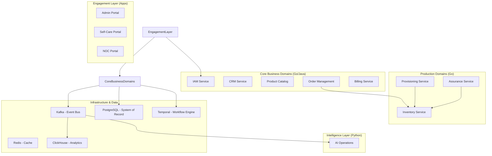

# TelcoFlow System Context

## Overview
TelcoFlow is a cloud-native OSS/BSS platform designed to manage the entire lifecycle of telecom services and customers.

## High-Level Architecture (Mermaid)

## Integration Points
- **Northbound**: Open APIs (TMF) for external partner and digital channel integration.
- **Southbound**: Provisioning adapters for network elements (Routers, OLTs, 5G Cores).
- **Security**: Keycloak as the Identity Provider (IdP).
