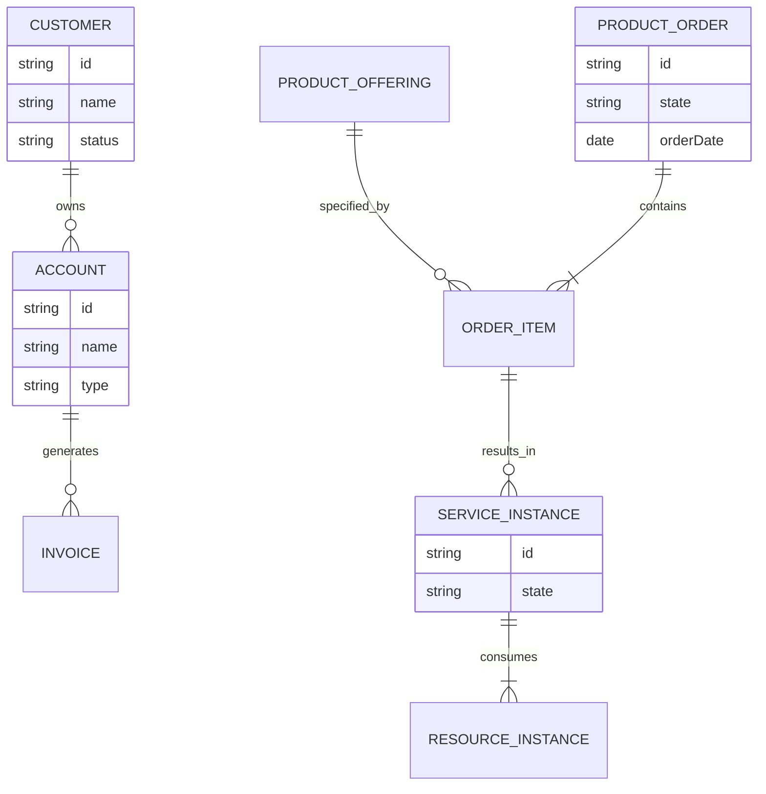

# Entity Relationship Diagram: Core Domains

```mermaid
erDiagram
    CUSTOMER ||--o{ ACCOUNT : owns
    CUSTOMER {
        string id
        string name
        string status
    }
    ACCOUNT ||--o{ INVOICE : generates
    ACCOUNT {
        string id
        string name
        string type
    }
    PRODUCT_OFFERING ||--o{ ORDER_ITEM : specified_by
    PRODUCT_ORDER ||--|{ ORDER_ITEM : contains
    PRODUCT_ORDER {
        string id
        string state
        date orderDate
    }
    ORDER_ITEM ||--o{ SERVICE_INSTANCE : results_in
    SERVICE_INSTANCE ||--|{ RESOURCE_INSTANCE : consumes
    SERVICE_INSTANCE {
        string id
        string state
    }
```
